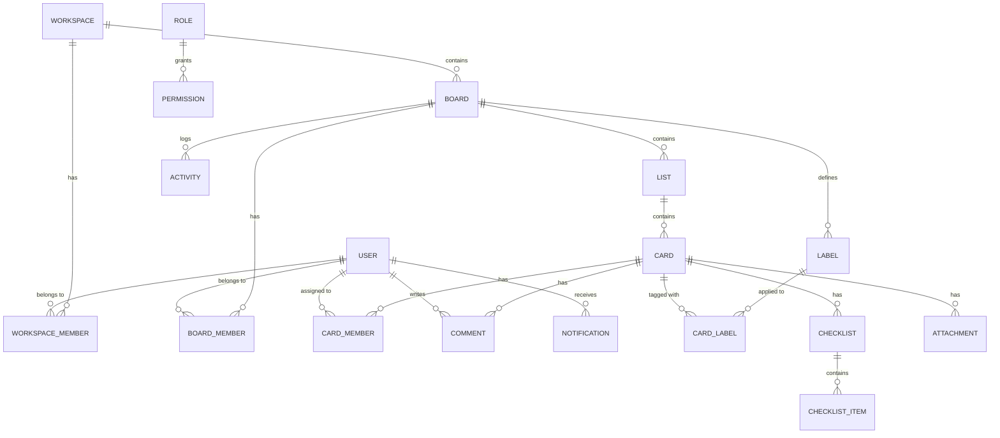

<h1 align="center">
  <br>
  🗂️ Kanby — Trello Clone Backend API
  <br>
</h1>

<p align="center">
  <em>A production-ready RESTful API for a Trello-like project management application, built with modern Node.js technologies.</em>
</p>

<p align="center">
  <a href="#-description">Description</a> •
  <a href="#-features">Features</a> •
  <a href="#️-tech-stack">Tech Stack</a> •
  <a href="#-prerequisites">Prerequisites</a> •
  <a href="#️-installation">Installation</a> •
  <a href="#-configuration">Configuration</a> •
  <a href="#️-usage">Usage</a> •
  <a href="#-project-structure">Project Structure</a> •
  <a href="#-api-documentation">API Docs</a> •
  <a href="#️-database">Database</a> •
  <a href="#-testing">Testing</a> •
  <a href="#-docker">Docker</a> •
  <a href="#-deployment">Deployment</a> •
  <a href="#-license">License</a>
</p>

<p align="center">
  
  
  
  
  
  
</p>

---

## 📋 Description

**Kanby Backend** is a robust and scalable RESTful API that powers a Trello-like project management application. It provides a complete backend solution for managing workspaces, boards, lists, cards, checklists, labels, comments, and real-time activity tracking.

The API follows a modular architecture pattern with clean separation of concerns — controllers, services, repositories, and entities — making it easy to maintain and extend. It features JWT-based authentication with Google OAuth2 integration, granular role-based access control (RBAC), file upload support via Cloudinary, email notifications with Nodemailer, and interactive API documentation through Swagger UI.

---

## 🚀 Features

- **🔐 Authentication & Authorization**
    - JWT-based authentication (Access & Refresh tokens)
    - Google OAuth2 login via Passport.js
    - Email verification with OTP
    - Password reset flow with secure email links
    - Rate limiting on sensitive endpoints

- **👥 Workspace Management**
    - Create, update, and delete workspaces
    - Invite and manage workspace members
    - Role-based access per workspace

- **📋 Board Management**
    - Full CRUD operations on boards
    - Board templates (create & reuse)
    - Board sharing via invite links and email
    - Star/unstar boards, archive/reopen
    - Custom background upload
    - Public & private visibility

- **📝 Lists & Cards**
    - Drag-and-drop position calculation with gap-based ordering
    - Archive and restore lists/cards
    - Card members assignment
    - Checklists with items
    - Labels with color coding
    - File attachments via Cloudinary

- **💬 Comments & Activity**
    - Comment system on cards
    - Event-driven activity logging (EventBus pattern)
    - Real-time notification system with pub/sub subscribers

- **🔍 Search**
    - Full-text search across boards, cards, and more

- **📖 API Documentation**
    - Auto-generated OpenAPI/Swagger documentation
    - Interactive UI at `/api-docs`

---

## 🛠️ Tech Stack

| Category             | Technology                                                                                                                                                                                                                                      |
| -------------------- | ----------------------------------------------------------------------------------------------------------------------------------------------------------------------------------------------------------------------------------------------- |
| **Runtime**          |  `v20+`                                                                                                                     |
| **Framework**        |  `v5.x`                                                                                                                     |
| **Language**         |  `v5.x`                                                                                                            |
| **Database**         |  `v18`                                                                                                             |
| **ORM**              |  `v0.3`                                                                                                                     |
| **Cache**            |  `v8`                                                                                                                             |
| **Auth**             |  +  |
| **Validation**       |  `v4`                                                                                                                                   |
| **File Storage**     |  + Multer                                                                                                          |
| **Email**            |                                                                                                                  |
| **Logging**          |  + Morgan                                                                                                                            |
| **API Docs**         |  (OpenAPI 3.0)                                                                                                              |
| **Containerization** |  + Docker Compose                                                                                                              |
| **Reverse Proxy**    |                                                                                                                                   |
| **CI/CD**            |                                                                                                         |
| **Linting**          |  +      |

---

## 📦 Prerequisites

Ensure you have the following installed on your system:

| Requirement                                        | Version   | Required                    |
| -------------------------------------------------- | --------- | --------------------------- |
| [Node.js](https://nodejs.org/)                     | `>= 20.x` | ✅                          |
| [npm](https://www.npmjs.com/)                      | `>= 10.x` | ✅                          |
| [Git](https://git-scm.com/)                        | Latest    | ✅                          |
| [Docker](https://www.docker.com/) & Docker Compose | Latest    | 🔶 Recommended              |
| [PostgreSQL](https://www.postgresql.org/)          | `>= 18`   | ⚠️ Only if not using Docker |
| [Redis](https://redis.io/)                         | `>= 8`    | ⚠️ Only if not using Docker |

---

## ⚙️ Installation

**1. Clone the repository**

```bash
git clone https://github.com/chiennguyencoder/trello-clone-backend.git
cd trello-clone-backend
```

**2. Install dependencies**

```bash
npm install
```

**3. Set up environment variables**

```bash
cp .env.example .env
```

Edit the `.env` file with your own configuration values (see [Configuration](#-configuration) below).

---

## 🔧 Configuration

Create a `.env` file in the project root with the following variables:

```env
# ─── Application ──────────────────────────────────────────
NODE_ENV=development
PORT=3000
CORS_ORIGIN=http://localhost:5173
BASE_URL=http://localhost:3000
SESSION_SECRET=your_session_secret
DEFAULT_GAP=100

# ─── PostgreSQL Database ─────────────────────────────────
POSTGRES_USER=postgres
POSTGRES_PASSWORD=your_db_password
POSTGRES_DB=dbtrello
DB_HOST=localhost
DATABASE_PORT=5432

# ─── Redis ────────────────────────────────────────────────
REDIS_HOST=redis
REDIS_PORT=6379
REDIS_URL=redis://localhost:6379

# ─── JWT Authentication ──────────────────────────────────
ACCESS_TOKEN_SECRET=your_access_token_secret
ACCESS_TOKEN_EXPIRES_IN=7d
REFRESH_TOKEN_SECRET=your_refresh_token_secret
REFRESH_TOKEN_EXPIRES_IN=7d
COOKIE_MAX_AGE=604800000

# ─── Google OAuth2 ────────────────────────────────────────
GOOGLE_CLIENT_ID=your_google_client_id
GOOGLE_CLIENT_SECRET=your_google_client_secret
GOOGLE_REDIRECT_URI=http://localhost:3000/api/auth/google/callback

# ─── Cloudinary (File Storage) ───────────────────────────
CLOUDINARY_CLOUD_NAME=your_cloud_name
CLOUDINARY_API_KEY=your_cloudinary_api_key
CLOUDINARY_API_SECRET=your_cloudinary_api_secret

# ─── SMTP (Email) ────────────────────────────────────────
SMTP_HOST=smtp.gmail.com
SMTP_PORT=587
SMTP_USER=your_email@gmail.com
SMTP_PASS=your_app_password
```

> [!NOTE]
> For Google OAuth2, create credentials at [Google Cloud Console](https://console.cloud.google.com/). For SMTP with Gmail, generate an [App Password](https://support.google.com/accounts/answer/185833).

---

## ▶️ Usage

### Development

Start the development server with hot-reload:

```bash
npm run dev
```

The API will be available at `http://localhost:3000` and Swagger UI at `http://localhost:3000/api-docs`.

### Production

Build and run for production:

```bash
# Build the TypeScript project
npm run build

# Start the production server
npm start
```

### Seed Data

Populate the database with sample data:

```bash
# Seed all data at once
npm run seed:all

# Or seed individual modules
npm run seed:auth
npm run seed:role
npm run seed:user
npm run seed:workspace
npm run seed:board
npm run seed:list
npm run seed:card
npm run seed:checklist
npm run seed:label
npm run seed:templates
```

> [!TIP]
> Default password for seeded test accounts: `Test@123456`

---

## 📁 Project Structure

```
backend/
├── .github/
│   └── workflows/
│       ├── dockerhub.yml          # CI/CD: Build & deploy to Docker Hub + EC2
│       └── main.yml               # CI: Automated code review on PRs
├── scripts/
│   ├── run-seed.ts                # Seed runner script
│   └── seeders/                   # Individual seed modules
├── src/
│   ├── api-docs/                  # OpenAPI/Swagger configuration
│   │   ├── openApiDocumentGenerator.ts
│   │   ├── openApiResponseBuilder.ts
│   │   └── openApiRouter.ts
│   ├── apis/                      # API modules (feature-based)
│   │   ├── index.ts               # Route aggregator
│   │   ├── auth/                  # Authentication endpoints
│   │   ├── users/                 # User management
│   │   ├── workspace/             # Workspace CRUD & members
│   │   ├── board/                 # Board CRUD, templates, sharing
│   │   ├── list/                  # List management
│   │   ├── card/                  # Card management
│   │   ├── checklist/             # Checklists & items
│   │   ├── comment/               # Card comments
│   │   ├── label/                 # Labels management
│   │   ├── activity/              # Activity logging & subscriber
│   │   ├── notification/          # Notification system
│   │   ├── role/                  # Role management
│   │   ├── permission/            # Permission management
│   │   ├── search/                # Search functionality
│   │   └── healthcheck/           # Health check endpoint
│   ├── config/                    # Application configuration
│   │   ├── config.ts              # Environment variable mapping
│   │   ├── typeorm.config.ts      # Database connection config
│   │   ├── redis.config.ts        # Redis client config
│   │   ├── passport.config.ts     # OAuth2 strategies
│   │   ├── cloundinary.ts         # Cloudinary setup
│   │   ├── email.config.ts        # SMTP transporter
│   │   ├── rateLimiter.config.ts  # Rate limiting rules
│   │   └── swagger.config.ts      # Swagger UI options
│   ├── entities/                  # TypeORM entity definitions
│   │   ├── user.entity.ts
│   │   ├── workspace.entity.ts
│   │   ├── board.entity.ts
│   │   ├── list.entity.ts
│   │   ├── card.entity.ts
│   │   ├── checklist.entity.ts
│   │   ├── comment.entity.ts
│   │   ├── label.entity.ts
│   │   ├── notification.entity.ts
│   │   ├── activity.entity.ts
│   │   ├── role.entity.ts
│   │   ├── permission.entity.ts
│   │   └── ...                    # Junction & relation entities
│   ├── enums/                     # Enum definitions
│   │   ├── roles.enum.ts
│   │   ├── permissions.enum.ts
│   │   ├── event-type.enum.ts
│   │   ├── notification.enum.ts
│   │   └── label.enum.ts
│   ├── events/                    # Event-driven architecture
│   │   ├── event-bus.ts           # EventEmitter-based pub/sub
│   │   └── interface.ts           # Event type interfaces
│   ├── middleware/                 # Express middleware
│   │   ├── authorization.ts       # RBAC permission checks
│   │   ├── error-handle.ts        # Global error handler
│   │   ├── upload.ts              # Multer file upload config
│   │   └── validate-handle.ts     # Zod request validation
│   ├── migrations/                # TypeORM migration files
│   ├── types/                     # TypeScript type definitions
│   ├── utils/                     # Utility functions
│   │   ├── jwt.ts                 # Token generation & verification
│   │   ├── authorizeHelper.ts     # Permission helper functions
│   │   ├── calcPosition.ts        # Drag-and-drop position calc
│   │   ├── generateOTP.ts         # OTP generator
│   │   ├── sendVerifyEmail.ts     # Email sender utility
│   │   ├── getResource.ts         # Resource fetcher
│   │   └── response.ts           # Standardized API responses
│   └── index.ts                   # Application entry point
├── docker-compose.yaml            # Multi-service Docker setup
├── dockerfile                     # Multi-stage Docker build
├── Caddyfile                      # Caddy reverse proxy config
├── nginx.conf                     # Nginx config (alternative)
├── tsconfig.json                  # TypeScript configuration
├── eslint.config.js               # ESLint configuration
├── nodemon.json                   # Dev server hot-reload config
├── package.json
└── .env                           # Environment variables (git-ignored)
```

Each API module follows a consistent structure:

```
apis/<module>/
├── <module>.controller.ts         # Request handling & business logic
├── <module>.service.ts            # Business logic layer (optional)
├── <module>.repository.ts         # Database queries (optional)
├── <module>.route.ts              # Express route definitions
├── <module>.schema.ts             # Zod validation schemas
├── <module>.dto.ts                # Data transfer objects (optional)
└── <module>.swagger.ts            # OpenAPI path definitions
```

---

## 📚 API Documentation

### Interactive Docs

Full API documentation is available via **Swagger UI** at:

```
http://localhost:3000/api-docs
```

### Authentication

The API uses **JWT Bearer Token** authentication:

1. Obtain tokens via `POST /api/auth/login` or `POST /api/auth/register`
2. Include the access token in the `Authorization` header:
    ```
    Authorization: Bearer <access_token>
    ```
3. Refresh expired tokens via `POST /api/auth/refresh-token`

### Endpoints

#### 🔐 Auth (`/api/auth`)

| Method | Endpoint                      | Description                  |
| ------ | ----------------------------- | ---------------------------- |
| `POST` | `/api/auth/register`          | Register a new account       |
| `POST` | `/api/auth/login`             | Login with email & password  |
| `POST` | `/api/auth/refresh-token`     | Refresh access token         |
| `GET`  | `/api/auth/google`            | Initiate Google OAuth2 login |
| `GET`  | `/api/auth/google/callback`   | Google OAuth2 callback       |
| `POST` | `/api/auth/forgot-password`   | Request password reset email |
| `POST` | `/api/auth/reset-password`    | Reset password with token    |
| `POST` | `/api/auth/send-verify-email` | Send email verification link |
| `GET`  | `/api/auth/verify-email`      | Verify email address         |

#### 👤 Users (`/api/users`)

| Method | Endpoint        | Description                            |
| ------ | --------------- | -------------------------------------- |
| `GET`  | `/api/users/me` | Get current authenticated user profile |

#### 🏢 Workspaces (`/api/workspaces`)

| Method | Endpoint          | Description              |
| ------ | ----------------- | ------------------------ |
| `GET`  | `/api/workspaces` | List all user workspaces |
| `POST` | `/api/workspaces` | Create a new workspace   |

#### 📋 Boards (`/api/boards`)

| Method   | Endpoint                                    | Description                |
| -------- | ------------------------------------------- | -------------------------- |
| `GET`    | `/api/boards`                               | List all boards            |
| `POST`   | `/api/boards`                               | Create a new board         |
| `GET`    | `/api/boards/starred`                       | Get starred boards         |
| `GET`    | `/api/boards/public`                        | Get public boards          |
| `GET`    | `/api/boards/archived`                      | Get archived boards        |
| `GET`    | `/api/boards/template`                      | List board templates       |
| `GET`    | `/api/boards/:boardId`                      | Get board details          |
| `PATCH`  | `/api/boards/:boardId`                      | Update board info          |
| `DELETE` | `/api/boards/:boardId`                      | Permanently delete a board |
| `POST`   | `/api/boards/:boardId/archive`              | Archive a board            |
| `POST`   | `/api/boards/:boardId/reopen`               | Reopen an archived board   |
| `POST`   | `/api/boards/:boardId/star`                 | Star / unstar a board      |
| `POST`   | `/api/boards/:boardId/background`           | Upload board background    |
| `POST`   | `/api/boards/:boardId/leave`                | Leave a board              |
| `GET`    | `/api/boards/:boardId/lists`                | Get all lists on a board   |
| `GET`    | `/api/boards/:boardId/members`              | Get board members          |
| `PATCH`  | `/api/boards/:boardId/members/:userId/role` | Update member role         |
| `DELETE` | `/api/boards/:boardId/members/:userId`      | Remove a member            |
| `POST`   | `/api/boards/:boardId/invite/email`         | Invite member via email    |
| `POST`   | `/api/boards/:boardId/invite/link`          | Generate share link        |
| `DELETE` | `/api/boards/:boardId/share-link`           | Revoke share link          |
| `PATCH`  | `/api/boards/:boardId/change-owner`         | Transfer board ownership   |
| `POST`   | `/api/boards/:boardId/template`             | Create template from board |
| `POST`   | `/api/boards/template/:templateId`          | Create board from template |

#### 📝 Lists (`/api/lists`)

| Method | Endpoint     | Description           |
| ------ | ------------ | --------------------- |
| `GET`  | `/api/lists` | Get lists for a board |
| `POST` | `/api/lists` | Create a new list     |

#### 🃏 Cards (`/api/cards`)

| Method   | Endpoint         | Description       |
| -------- | ---------------- | ----------------- |
| `GET`    | `/api/cards/:id` | Get card details  |
| `POST`   | `/api/cards`     | Create a new card |
| `PUT`    | `/api/cards/:id` | Update card info  |
| `DELETE` | `/api/cards/:id` | Delete a card     |

#### ✅ Checklists (`/api/checklists`)

| Method | Endpoint          | Description                  |
| ------ | ----------------- | ---------------------------- |
| `POST` | `/api/checklists` | Create a checklist on a card |

#### 💬 Comments (`/api/comments`)

| Method | Endpoint        | Description             |
| ------ | --------------- | ----------------------- |
| `POST` | `/api/comments` | Add a comment to a card |

#### 🏷️ Labels (`/api/labels`)

| Method | Endpoint      | Description    |
| ------ | ------------- | -------------- |
| `POST` | `/api/labels` | Create a label |

#### 📊 Activities (`/api/activities`)

| Method | Endpoint          | Description       |
| ------ | ----------------- | ----------------- |
| `GET`  | `/api/activities` | Get activity logs |

#### 🔔 Notifications (`/api/notifications`)

| Method | Endpoint             | Description            |
| ------ | -------------------- | ---------------------- |
| `GET`  | `/api/notifications` | Get user notifications |

#### 🔍 Search (`/api/search`)

| Method | Endpoint      | Description                       |
| ------ | ------------- | --------------------------------- |
| `GET`  | `/api/search` | Search across boards, cards, etc. |

#### 🩺 Health Check

| Method | Endpoint      | Description             |
| ------ | ------------- | ----------------------- |
| `GET`  | `/api/health` | Check API health status |

### Request/Response Examples

#### Register

```http
POST /api/auth/register
Content-Type: application/json

{
  "email": "user@example.com",
  "password": "SecureP@ss123",
  "displayName": "John Doe"
}
```

**Success Response** `201 Created`:

```json
{
    "success": true,
    "message": "Registration successful",
    "data": {
        "user": {
            "id": "uuid-here",
            "email": "user@example.com",
            "displayName": "John Doe"
        },
        "accessToken": "eyJhbGciOiJIUzI1NiIs...",
        "refreshToken": "eyJhbGciOiJIUzI1NiIs..."
    }
}
```

#### Login

```http
POST /api/auth/login
Content-Type: application/json

{
  "email": "user@example.com",
  "password": "SecureP@ss123"
}
```

**Success Response** `200 OK`:

```json
{
    "success": true,
    "message": "Login successful",
    "data": {
        "accessToken": "eyJhbGciOiJIUzI1NiIs...",
        "refreshToken": "eyJhbGciOiJIUzI1NiIs..."
    }
}
```

**Error Response** `401 Unauthorized`:

```json
{
    "success": false,
    "message": "Invalid email or password"
}
```

---

## 🗄️ Database

### Schema / Models

The application uses **TypeORM** with **PostgreSQL**. Below is the entity relationship overview:



**Core Entities:**

| Entity             | Description                                   |
| ------------------ | --------------------------------------------- |
| `User`             | User accounts with profile, email, OAuth data |
| `Workspace`        | Top-level organizational container            |
| `WorkspaceMembers` | Workspace membership with roles               |
| `Board`            | Kanban boards within workspaces               |
| `BoardMembers`     | Board membership with roles                   |
| `List`             | Ordered columns within boards                 |
| `Card`             | Task cards within lists                       |
| `CardMembers`      | Card member assignments                       |
| `Checklist`        | Checklists attached to cards                  |
| `ChecklistItem`    | Individual checklist items                    |
| `Comment`          | Comments on cards                             |
| `Label`            | Color-coded labels for boards                 |
| `CardLabel`        | Many-to-many card-label junction              |
| `Attachment`       | File attachments on cards                     |
| `Activity`         | Audit trail / activity logs                   |
| `Notification`     | User notification records                     |
| `Role`             | Role definitions (admin, member, viewer)      |
| `Permission`       | Granular permission definitions               |
| `MailTemplate`     | Email template storage                        |

### Migration

TypeORM is configured with `synchronize: true` in development, which automatically syncs the schema. For production, use migrations:

```bash
# Generate a new migration
npx typeorm migration:generate -d src/config/typeorm.config.ts src/migrations/MigrationName

# Run pending migrations
npx typeorm migration:run -d src/config/typeorm.config.ts

# Revert the last migration
npx typeorm migration:revert -d src/config/typeorm.config.ts
```

> [!WARNING]
> **Do not use `synchronize: true` in production.** It may lead to data loss. Always use migrations for production schema changes.

---

## 🧪 Testing

### Linting & Formatting

```bash
# Run ESLint
npm run lint

# Auto-fix ESLint issues
npm run lint:fix

# Check code formatting
npm run prettier

# Auto-fix formatting
npm run prettier:fix
```

### Manual Testing

- Use **Swagger UI** at `/api-docs` for interactive endpoint testing
- Use **Postman** or **cURL** for manual API requests
- Seed test data with `npm run seed:all` (default password: `Test@123456`)

---

## 🐳 Docker

The project includes a complete Docker setup with multi-stage builds and a full service stack.

### Services

| Service | Image               | Port        | Description                   |
| ------- | ------------------- | ----------- | ----------------------------- |
| `app`   | Custom (Dockerfile) | `3000`      | Node.js API server            |
| `db`    | `postgres:18`       | `5432`      | PostgreSQL database           |
| `redis` | `redis:8-alpine`    | `6379`      | Redis cache                   |
| `caddy` | `caddy:2-alpine`    | `80`, `443` | Reverse proxy with auto-HTTPS |

### Quick Start with Docker

```bash
# Build and start all services
docker compose up -d --build

# View logs
docker compose logs -f app

# Stop all services
docker compose down

# Stop and remove volumes (⚠️ deletes data)
docker compose down -v
```

### Dockerfile Highlights

- **Multi-stage build** for optimized image size
- Stage 1 (`build`): Compiles TypeScript to JavaScript
- Stage 2 (`runtime`): Runs only the compiled output with production dependencies
- Automatic database seeding on container startup

---

## 🚢 Deployment

### CI/CD Pipeline

The project uses **GitHub Actions** for automated build and deployment:

#### 1. Code Review (`main.yml`)

- Triggered on pull requests
- Automated AI-powered code review via [CodeRabbit](https://coderabbit.ai/)

#### 2. Build & Deploy (`dockerhub.yml`)

- Triggered on push to `main` branch
- Builds Docker image and pushes to **Docker Hub**
- Tags with `latest` and commit SHA
- Auto-deploys to **AWS EC2** via SSH

### Deployment Architecture

```
GitHub (push to main)
    │
    ▼
GitHub Actions
    ├── Build Docker Image
    ├── Push to Docker Hub
    │       ├── kanby-backend:latest
    │       └── kanby-backend:<sha>
    └── Deploy to EC2
            ├── Pull latest image
            └── docker compose up -d
```

### Manual Deployment

```bash
# Build production image
docker build -t kanby-backend .

# Run with environment file
docker run -d \
  --name kanby-backend \
  --env-file .env.production \
  -p 3000:3000 \
  kanby-backend
```

---

## 🤝 Contributing

Contributions are welcome! Follow these steps:

1. Fork the repository
2. Create a feature branch: `git checkout -b feature/amazing-feature`
3. Commit your changes following [Conventional Commits](https://www.conventionalcommits.org/)
4. Push to the branch: `git push origin feature/amazing-feature`
5. Open a **Pull Request** with a clear description

> [!NOTE]
> All PRs are automatically reviewed by CodeRabbit AI. Please address any feedback before requesting a human review.

---
